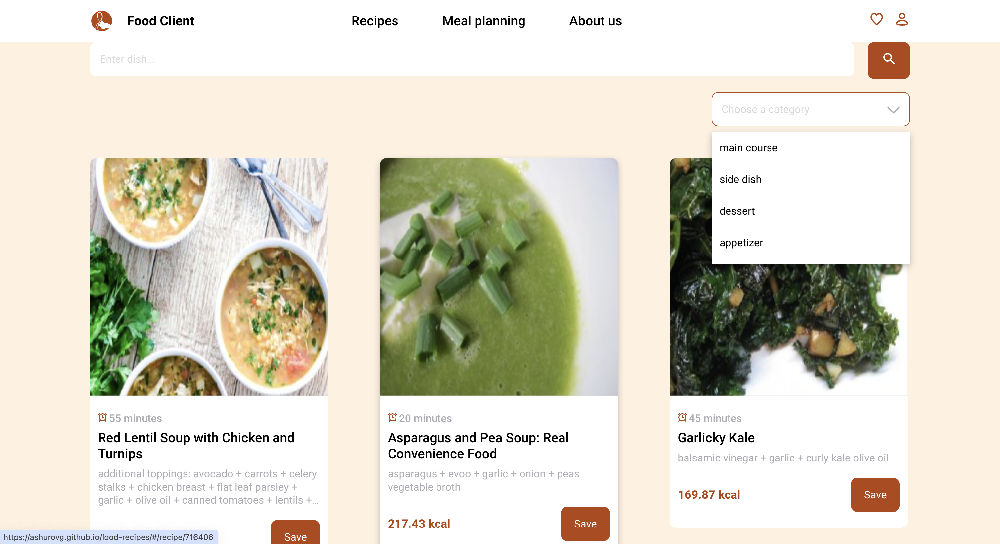
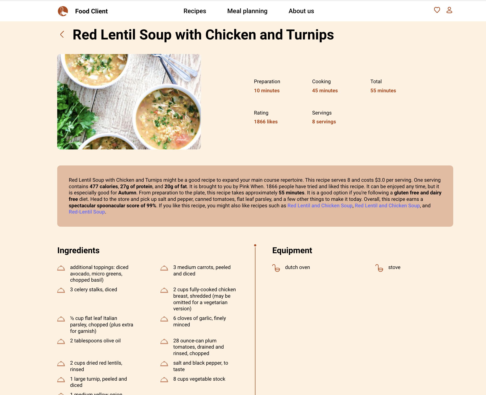
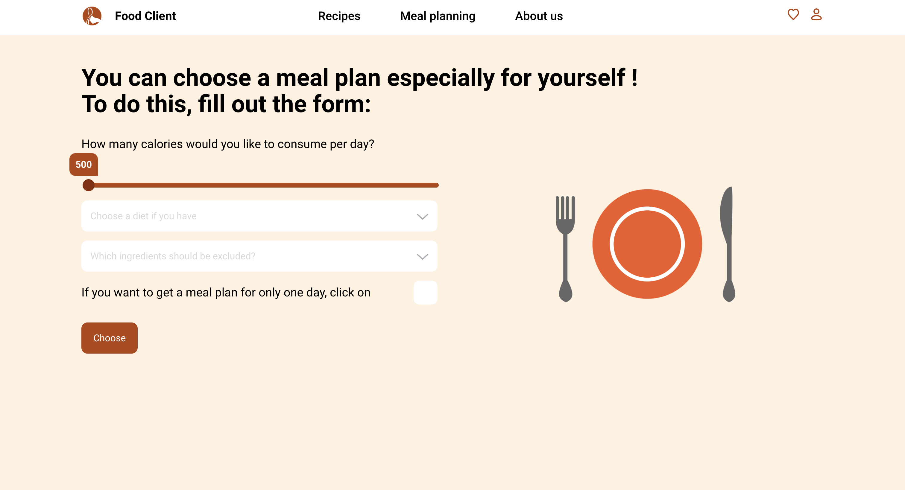
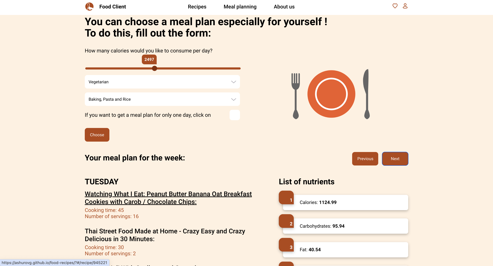
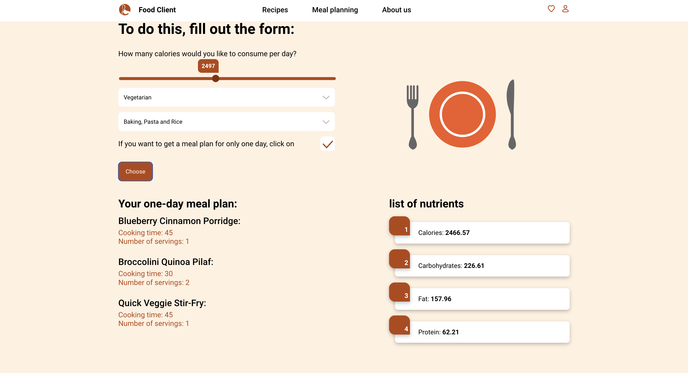
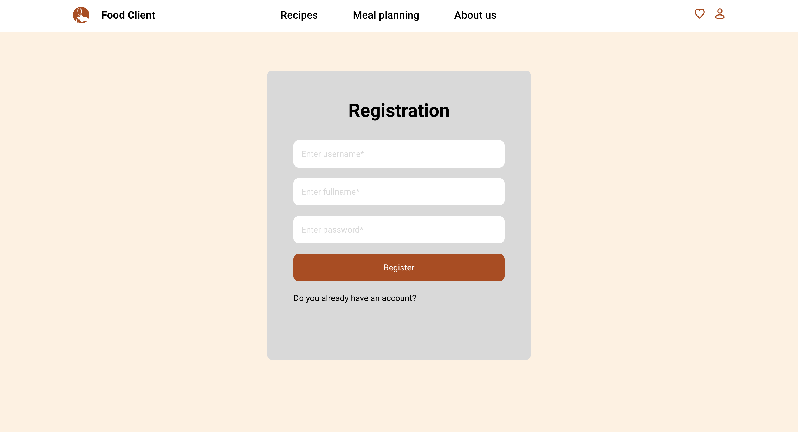
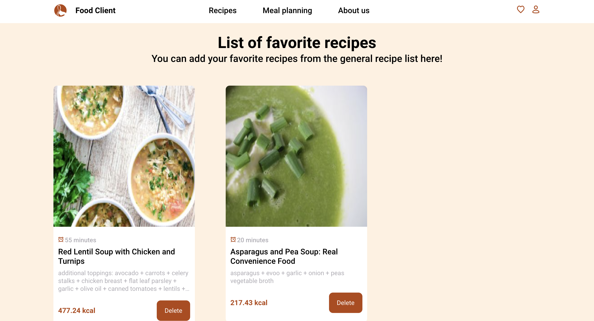
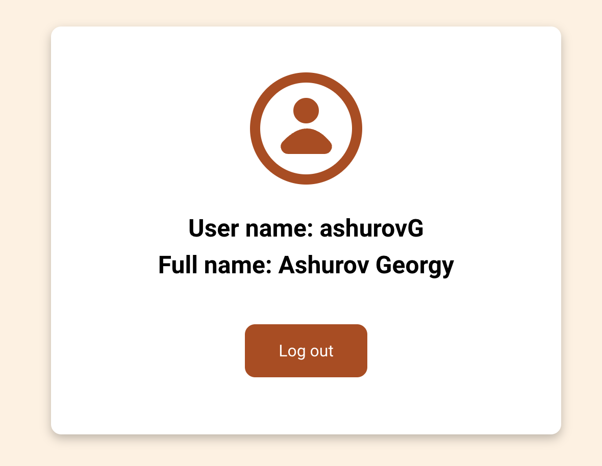

# WEB-приложение для просмотра рецептов и планирования питания

### Приложеие развернуто на pages: [открыть приложение]

### Стек технологий: React, Typescript, MobX, Webpack, SCSS modules. 

### В приложении используется готовое API: https://spoonacular.com/food-api

## Функционал приложения
- Просмотр доступных рецептов (поиск рецепта по категории, названию)
- Добавление рецепта в избранные
- Формирование индивидуального плана питания на неделю/день по калориям, нежелательным продуктам и диете
- Авторизация и регистрация
- Просмотр профиля авторизованного пользователя

## Экраны приложения

### Главная страница:

### Страница одного рецепта:

### Страница генерации плана питания:

### Страница регистрации:

### Страница избранных рецептов:

### Страница профиля:

   [Открыть приложение]: <https://ashurovg.github.io/food-recipes/>
